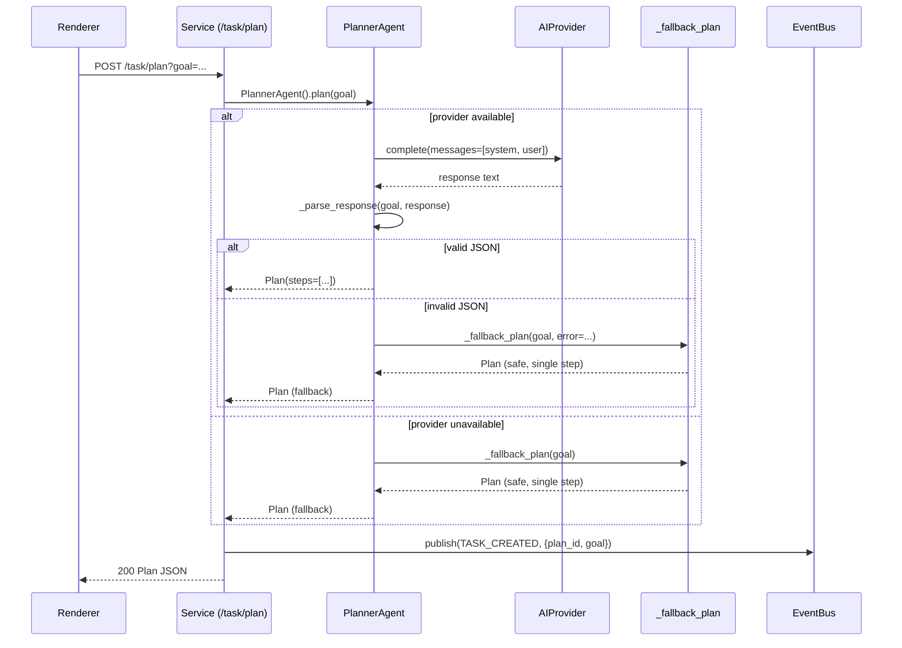

# AI Agent

> How the AI thinks, decides, and acts. Source-of-truth:
> `apps/automation-service/automation_service/agents/planner.py`,
> `apps/automation-service/automation_service/ai_providers/base.py`,
> and the `Plan` / `PlanStep` / `ActionRequest` Pydantic models in
> `apps/automation-service/automation_service/models.py`.

## 1. Overview

The agent is **not** a single monolithic brain. Per master prompt §7
it is a federation of specialised components, each with a single
responsibility:

```
+-----------------+
| PlannerAgent    |  goal (NL) -> Plan
+-----------------+
        |
        v
+-----------------+
| PermissionEngine|  Plan -> allow / deny / ask
+-----------------+
        |
        v
+-----------------+
| ExecutorAgent   |  Plan -> tool calls (orchestrated by WorkflowExecutor)
+-----------------+
        |
        v
+-----------------+
| ObserverAgent   |  computer state -> structured observations
+-----------------+
        |
        v
+-----------------+
| VerificationAgent| observation -> did we achieve the goal?
+-----------------+
        |
        v
+-----------------+
| RecoveryAgent   | failure -> revised Plan
+-----------------+
```

The MVP implements the **Planner** fully and stubs the others
through the `WorkflowExecutor` (which acts as executor + observer
+ verification when no separate agent class is needed). The full
multi-agent split is **Phase 3 — Coming Soon**.

## 2. Agent components (§7)

### 2.1 PlannerAgent

Source: `apps/automation-service/automation_service/agents/planner.py`

Converts a natural-language goal into a structured `Plan` that the
workflow engine can execute. It:

1. Loads a system prompt that lists every tool in the registry and
   the JSON schema the response must match.
2. Calls the configured `AIProvider` with `temperature=0.1,
   max_tokens=1500`.
3. Extracts JSON from the response with a tolerant regex
   (`re.search(r"\{[\s\S]*\}", response)`).
4. Parses the JSON into a `Plan` Pydantic model.
5. Falls back to a deterministic safe plan when no provider is
   available or the AI call fails.

The fallback plan is a single `screen.capture` step — side-effect
free and immediately useful for debugging. It is never destructive.

### 2.2 ExecutorAgent — **Phase 1 — Coming Soon**

The MVP uses `WorkflowExecutor` directly; a separate
`ExecutorAgent` class that wraps the executor with richer
decision-making (e.g. choosing between equivalent tools, asking
the observer for confirmation before risky steps) is planned.

### 2.3 ObserverAgent — **Phase 3 — Coming Soon**

Will own:

- Screenshot + active window detection
- OCR
- UI element detection (accessibility tree)
- Text extraction
- Visual target detection
- Region capture
- Screen comparison

The observer produces structured observations that the planner and
verification agent consume. The MVP fakes this through the `screen.*`
tools returning their observations inline.

### 2.4 VerificationAgent — **Phase 1 — Coming Soon**

Checks whether an action succeeded. After clicking "Download" the
verification agent queries:

- Did the file appear in Downloads?
- Did the browser show a download progress bar?
- Did the filename match the expected pattern?

The MVP returns `verified=True` for any `COMPLETED` step; the
`PlanStep.verification` field is the hook the verification agent
will dispatch on.

### 2.5 RecoveryAgent — **Phase 3 — Coming Soon**

Handles recoverable failures:

- element moved → re-query the DOM
- popup appeared → dismiss and retry
- browser tab changed → re-navigate
- window minimised → restore
- page loaded slowly → wait + retry
- application became unresponsive → kill + relaunch

The recovery agent must never endlessly loop: every recovery attempt
increments a per-step counter and the run pauses after
`step.retry_count` failures. It must never blindly click random
locations — every recovery action must target a named element or
have a confidence score above `settings.min_vision_confidence`.

## 3. Planner system prompt

Source: `apps/automation-service/automation_service/agents/planner.py:SYSTEM_PROMPT`

```
You are a desktop automation planner. Convert the user's goal
into a JSON plan that the workflow engine can execute.

Available tools (each becomes a step with action=tool_name):
- mouse.click, mouse.move, mouse.scroll
- keyboard.type, keyboard.hotkey
- screen.capture, screen.ocr
- file.read, file.write, file.move, file.rename, file.list
- app.launch
- window.list, process.list
- browser.open, browser.navigate, browser.click, browser.type, browser.extract

Respond with ONLY a JSON object matching this schema:
{
  "goal": "<original goal>",
  "steps": [
    {"id": "1", "action": "<tool_name>", "args": {...}, "risk_level": "low|medium|high|critical",
     "confidence": 0.0-1.0, "timeout_ms": 10000, "retry_count": 0, "fallback": null|"tool_name",
     "verification": null|"description"}
  ],
  "required_permissions": ["allow_once"],
  "overall_risk": "low|medium|high|critical",
  "potential_side_effects": ["..."],
  "estimated_duration_seconds": 30
}

Rules:
1. Every step MUST have a risk_level.
2. Set confidence based on how sure you are the step will succeed.
3. Identify destructive operations and mark them HIGH or CRITICAL.
4. Use the simplest tool that achieves the goal — never call AI for things
   Python can determine deterministically (master prompt §58).
5. If a step might fail due to UI changes, set a fallback to a different tool
   (e.g. fallback from browser.click to screen.ocr + mouse.click).
```

The system prompt is a string constant in `planner.py`. It is built
once at module load and reused for every planner call.

## 4. Plan JSON schema (the planner's output contract)

The planner returns a Pydantic `Plan` model. Here is the JSON
shape the AI is asked to produce and that `_parse_response`
validates:

```json
{
  "goal": "Open Chrome, go to Google, search AI automation, screenshot",
  "steps": [
    {
      "id": "1",
      "action": "app.launch",
      "args": {"app": "chrome"},
      "risk_level": "medium",
      "confidence": 0.95,
      "timeout_ms": 10000,
      "retry_count": 1,
      "fallback": null,
      "verification": "process_running"
    },
    {
      "id": "2",
      "action": "browser.navigate",
      "args": {"url": "https://www.google.com"},
      "risk_level": "low",
      "confidence": 0.98,
      "timeout_ms": 30000,
      "retry_count": 2,
      "fallback": null,
      "verification": "dom_text_present"
    },
    {
      "id": "3",
      "action": "browser.type",
      "args": {"selector": "input[name='q']", "text": "AI automation"},
      "risk_level": "medium",
      "confidence": 0.90,
      "timeout_ms": 10000,
      "retry_count": 1,
      "fallback": "keyboard.type",
      "verification": null
    },
    {
      "id": "4",
      "action": "keyboard.hotkey",
      "args": {"keys": ["Return"]},
      "risk_level": "medium",
      "confidence": 0.95,
      "timeout_ms": 2000,
      "retry_count": 0,
      "fallback": null,
      "verification": null
    },
    {
      "id": "5",
      "action": "screen.capture",
      "args": {"filename": "google_{{today}}.png"},
      "risk_level": "low",
      "confidence": 1.0,
      "timeout_ms": 3000,
      "retry_count": 0,
      "fallback": null,
      "verification": "file_exists"
    }
  ],
  "required_permissions": ["allow_once"],
  "overall_risk": "medium",
  "potential_side_effects": [
    "Opens Chrome browser",
    "Saves a PNG screenshot to download/screenshots/"
  ],
  "estimated_duration_seconds": 25
}
```

The Pydantic models that enforce this shape live in
`apps/automation-service/automation_service/models.py`:

```python
class PlanStep(BaseModel):
    id: str
    action: str
    args: dict[str, Any] = Field(default_factory=dict)
    risk_level: RiskLevel = RiskLevel.LOW
    confidence: float = Field(default=1.0, ge=0.0, le=1.0)
    timeout_ms: int = 10_000
    retry_count: int = 0
    fallback: Optional[str] = None
    verification: Optional[str] = None


class Plan(BaseModel):
    id: UUID = Field(default_factory=uuid4)
    goal: str
    steps: list[PlanStep]
    required_permissions: list[PermissionLevel]
    overall_risk: RiskLevel
    potential_side_effects: list[str] = Field(default_factory=list)
    estimated_duration_seconds: int = 30
    variables: dict[str, str] = Field(default_factory=dict)
```

## 5. AI planning safety (§66)

Before any execution, the planner must surface the safety-relevant
fields. The `Plan` model encodes them as required fields:

| Field | Purpose |
|---|---|
| `goal` | What the user asked for, in their words |
| `steps` | The ordered list of actions |
| `required_permissions` | What permission levels the plan needs |
| `overall_risk` | Max risk across all steps |
| `potential_side_effects` | Human-readable list of what could go wrong |
| `estimated_duration_seconds` | Best-effort ETA |

The renderer renders this as a plan card before execution:

```
Goal: Open Chrome, go to Google, search AI automation, screenshot

Risk: Medium

Permissions required:
- Allow Once (browser navigation, keyboard input)

Potential side effects:
- Opens Chrome browser
- Saves a PNG screenshot to download/screenshots/

Estimated duration: 25 seconds

[5 steps — click to expand]

[Cancel]  [Run]
```

## 6. AI provider abstraction (§6)

Source: `apps/automation-service/automation_service/ai_providers/base.py`

The agent never talks to an AI vendor directly. It talks to an
`AIProvider` ABC:

```python
class AIProvider(abc.ABC):
    name: str = "base"

    def __init__(self, config: AIProviderConfig) -> None:
        self.config = config

    @abc.abstractmethod
    async def complete(self, messages: list[dict[str, str]], **kwargs: Any) -> str:
        raise NotImplementedError

    async def complete_with_vision(
        self, messages: list[dict[str, str]], image_paths: list[str], **kwargs: Any
    -> str:
        raise NotImplementedError(f"{self.name} does not support vision")
```

Five concrete implementations ship in the MVP:

| Class | `name` | Backend | Lazy import |
|---|---|---|---|
| `OpenAIProvider` | `openai` | `openai` package | `from openai import AsyncOpenAI` |
| `AnthropicProvider` | `anthropic` | `anthropic` package | `from anthropic import AsyncAnthropic` |
| `GeminiProvider` | `gemini` | `google-generativeai` | `import google.generativeai as genai` |
| `OllamaProvider` | `ollama` | local Ollama HTTP API | `import aiohttp` |
| `CustomProvider` | `custom` | OpenAI-compatible (LM Studio, vLLM) | reuses `OpenAIProvider` |

A factory `get_provider(name, config)` resolves by string name:

```python
_PROVIDERS: dict[str, type[AIProvider]] = {
    "openai": OpenAIProvider,
    "anthropic": AnthropicProvider,
    "gemini": GeminiProvider,
    "ollama": OllamaProvider,
    "custom": CustomProvider,
}

def get_provider(name: str, config: AIProviderConfig) -> AIProvider:
    if name not in _PROVIDERS:
        raise ValueError(f"Unknown AI provider: {name}. Available: {list(_PROVIDERS)}")
    return _PROVIDERS[name](config)
```

### 6.1 `AIProviderConfig`

```python
@dataclass
class AIProviderConfig:
    name: str
    api_key: Optional[str] = None
    base_url: Optional[str] = None
    model: str = ""
    temperature: float = 0.2
    max_tokens: int = 2000
    vision: bool = False
    reasoning: bool = False
```

Crucially, `api_key` is read from the OS credential store at
runtime by the agent that needs it (see `docs/security.md` §8). It
is never stored in the `AIProviderConfig` dataclass that gets
serialised or logged.

### 6.2 Risk from text (deterministic backstop)

A static helper on `AIProvider`:

```python
@staticmethod
def _risk_from_text(text: str) -> RiskLevel:
    t = text.lower()
    if any(k in t for k in ("delete", "rm -rf", "format", "format disk", "drop table")):
        return RiskLevel.CRITICAL
    if any(k in t for k in ("install", "modify", "system", "registry", "password", "purchase", "send")):
        return RiskLevel.HIGH
    if any(k in t for k in ("move", "rename", "edit", "close", "download")):
        return RiskLevel.MEDIUM
    return RiskLevel.LOW
```

This is a backstop. If the planner fails to assign a `risk_level`,
`_parse_response` uses the maximum of `step.risk_level` across
the steps as the `overall_risk`. If the planner assigns an unknown
risk string, `_risk_from_text` is consulted.

## 7. Local-first policy (§45, §58)

> Don't call AI to determine whether a file exists. Use Python.

The agent follows this rule in three concrete places:

1. **Planner fallback.** When `OPENAI_API_KEY` (or the configured
   provider's key) is absent, `PlannerAgent.__init__` lets
   `provider = None` and `plan()` returns the deterministic safe
   plan instead of throwing. The user always gets a runnable plan.

2. **Tool selection.** The planner's system prompt explicitly tells
   the AI: "Use the simplest tool that achieves the goal — never
   call AI for things Python can determine deterministically." The
   planner cannot ask the AI "does this file exist?" — it must use
   the `file.read` tool which calls Python's `Path.exists()`.

3. **Verification.** Verification strategies (`file_exists`,
   `process_running`, `dom_text_present`) are Python checks, not
   AI calls. AI is only consulted for `ai_condition` predicates
   (Phase 3) where the predicate itself is ambiguous.

### 7.1 Offline mode

When no network is available:

- The planner falls back to the deterministic plan.
- The OCR tools fall back to local `pytesseract` (already the default).
- The browser tools continue to work for offline pages.
- The renderer shows an "Offline Mode" badge.

The agent never silently fails on a missing network.

## 8. Vision capability (§86)

For difficult applications where DOM selectors are unreliable, the
agent can use a vision model. The pipeline:

```
Screenshot
   |
   v
Vision Model (complete_with_vision)
   |
   v
Identify target
   |
   v
Bounding box {x, y, width, height}
   |
   v
Confidence score [0.0, 1.0]
   |
   v
Policy check: confidence >= settings.min_vision_confidence (0.85)
   |
   v
Click at bounding box centre
   |
   v
Verify (DOM or screenshot diff)
```

If confidence is below the threshold, the agent **asks the user**.
It does not guess. The master prompt §86 is unambiguous:

> If confidence is low: Ask user. Do not guess.

The vision call is gated by `settings.use_vision_only_when_required`
(default `True`). When this is on, the agent only calls
`complete_with_vision` after the deterministic path (DOM
selectors + OCR + image recognition) has failed.

> The vision pipeline is **Phase 3 — Coming Soon**. The
> `complete_with_vision` ABC method is defined; the
> `OpenAIProvider` and `AnthropicProvider` will implement it. The
> bounding-box → click orchestration is the remaining work.

## 9. Action confidence (§87)

Every AI-generated action carries:

| Field | Type | Purpose |
|---|---|---|
| `confidence` | `float [0.0, 1.0]` | How sure the AI is the action will succeed |
| `reason` | `Optional[str]` | Why this action was chosen (the AI's reasoning, abridged) |
| `target` | `Optional[str]` | The intended target (CSS selector, app name, file path) |
| `verification` | `Optional[str]` | Strategy to confirm success |
| `risk` | `RiskLevel` | LOW / MEDIUM / HIGH / CRITICAL |

The `ActionRequest` Pydantic model:

```python
class ActionRequest(BaseModel):
    tool: str
    args: dict[str, Any] = Field(default_factory=dict)
    confidence: float = Field(default=1.0, ge=0.0, le=1.0)
    reason: Optional[str] = None
```

And `PlanStep`:

```python
class PlanStep(BaseModel):
    id: str
    action: str
    args: dict[str, Any] = Field(default_factory=dict)
    risk_level: RiskLevel = RiskLevel.LOW
    confidence: float = Field(default=1.0, ge=0.0, le=1.0)
    timeout_ms: int = 10_000
    retry_count: int = 0
    fallback: Optional[str] = None
    verification: Optional[str] = None
```

Example rendered to the user before execution:

```
Action: Click "Download"

Confidence: 96%
Risk: Low
Verification: Downloaded file exists
```

Low confidence (< `settings.min_vision_confidence`) does not block
execution outright — it triggers a UI prompt asking the user to
confirm before the step runs.

## 10. Cost control (§58)

The agent enforces hard cost limits per task:

| Setting | Default | Enforcement |
|---|---|---|
| `max_ai_calls_per_task` | 25 | Counter in `PlannerAgent`; raises `RuntimeError` when exceeded |
| `max_tokens` | per provider config | Passed as `max_tokens` to every `complete()` call |
| `default_ai_provider` | `openai` | Used when none is specified per-task |
| `default_ai_model` | `gpt-4o-mini` | Cheap default; user can upgrade per-task |
| `use_local_model_first` | `False` | When `True`, planner tries `OllamaProvider` first, falls back to cloud |
| `use_vision_only_when_required` | `True` | No vision calls unless deterministic paths failed |

The planner emits a `TASK_FAILED` event with `error="max AI calls
exceeded"` if the cap is hit mid-task. The user can override the cap
per-task via the `Plan.variables` dict (`{"max_ai_calls": 50}`) but
cannot disable it entirely.

Token usage is logged to the planned `ai_request_logs` table
(encrypted at rest, gated behind `developer_mode`) — see
`docs/security.md` §3.3.

> The cost-control counter is **Phase 1 — Coming Soon**. The
> settings are defined; the counter that aborts a task when the
> cap is reached is the remaining work.

## 11. Memory (§84)

The agent has four memory layers. None of them auto-persists
sensitive information.

| Layer | Stored where | Lifetime | Example |
|---|---|---|---|
| User Preferences | `settings` table | Permanent (until user deletes) | "Reports go in Documents/Reports" |
| Workflow Memory | `workflows.variables_json` | Per workflow | "Last run processed 184 files" |
| Application Memory | `device_profiles.config_json` | Per profile | "Chrome is the default browser" |
| Task Context | `tasks.plan_json` + `tasks.result_json` | Per task | The plan that ran and its outcome |
| Temporary Memory | in-memory only (`WorkflowExecutor._runs`) | Per run | Currently selected file, last screenshot path |

Sensitive information (passwords, API keys, cookies, clipboard
contents marked sensitive) is **never** written to persistent
memory. The `SecretMasker` (planned, see `docs/security.md` §8.3)
scrubs such values before they reach any persistence layer.

Memory controls (planned in Settings → Privacy):

- Inspect stored memories.
- Delete individual memories.
- Clear all workflow memory.
- Export memories to JSON (with secrets redacted).

> Persistent memory beyond the schema columns already in place is
> **Phase 3 — Coming Soon**. The `tasks.plan_json` and
> `tasks.result_json` columns already capture per-task context; the
> user-facing memory browser is the remaining work.

## 12. Planner call flow



## 13. `_parse_response` — the safety-critical parser

```python
def _parse_response(self, goal: str, response: str) -> Plan:
    m = re.search(r"\{[\s\S]*\}", response)
    if not m:
        return self._fallback_plan(goal, error="no JSON in planner response")
    try:
        data = json.loads(m.group(0))
    except json.JSONDecodeError as exc:
        return self._fallback_plan(goal, error=f"invalid JSON: {exc}")

    steps = [
        PlanStep(
            id=s.get("id", str(i + 1)),
            action=s["action"],
            args=s.get("args", {}),
            risk_level=RiskLevel(s.get("risk_level", "low")),
            confidence=float(s.get("confidence", 1.0)),
            timeout_ms=int(s.get("timeout_ms", 10_000)),
            retry_count=int(s.get("retry_count", 0)),
            fallback=s.get("fallback"),
            verification=s.get("verification"),
        )
        for i, s in enumerate(data.get("steps", []))
    ]

    risk_str = data.get("overall_risk", "low")
    try:
        overall_risk = RiskLevel(risk_str)
    except ValueError:
        overall_risk = max((s.risk_level for s in steps), default=RiskLevel.LOW)

    perm_strs = data.get("required_permissions", ["allow_once"])
    perms: list[PermissionLevel] = []
    for p in perm_strs:
        try:
            perms.append(PermissionLevel(p))
        except ValueError:
            pass
    if not perms:
        perms = [PermissionLevel.ALLOW_ONCE]

    return Plan(
        id=uuid4(),
        goal=goal,
        steps=steps,
        required_permissions=perms,
        overall_risk=overall_risk,
        potential_side_effects=data.get("potential_side_effects", []),
        estimated_duration_seconds=int(data.get("estimated_duration_seconds", 30)),
    )
```

Safety properties of this parser:

1. **Action is required.** A step without `action` raises
   `KeyError("action")`, which propagates up to `_execute_step` and
   is caught there as a step failure. The tool registry will also
   reject unknown tool names.
2. **Risk level is coerced.** An unknown string falls back to `LOW`.
   The `overall_risk` is then derived as `max(step.risk_level)` —
   pessimistic by design.
3. **Permissions are filtered.** Unknown permission strings are
   silently dropped. If all are dropped, the default `ALLOW_ONCE`
   applies. The engine still gates execution per-step regardless of
   what the planner claims.
4. **Confidence is clamped.** `float(s.get("confidence", 1.0))`
   passes through Pydantic's `Field(ge=0.0, le=1.0)` constraint,
   which raises `ValidationError` if out of range.
5. **JSON is extracted from text.** Chain-of-thought rambling
   outside the braces is discarded — only the structured plan
   survives.

## 14. `_fallback_plan` — the safe default

```python
def _fallback_plan(self, goal: str, error: str | None = None) -> Plan:
    return Plan(
        id=uuid4(),
        goal=goal,
        steps=[
            PlanStep(
                id="1",
                action="screen.capture",
                args={"filename": f"goal_{int(datetime.now(timezone.utc).timestamp())}.png"},
                risk_level=RiskLevel.LOW,
                confidence=1.0,
                verification="file_exists",
            )
        ],
        required_permissions=[PermissionLevel.ALLOW_ONCE],
        overall_risk=RiskLevel.LOW,
        potential_side_effects=[],
        estimated_duration_seconds=5,
        variables={"fallback_reason": error or "no AI provider available"},
    )
```

The fallback plan:

- Is always LOW risk.
- Always succeeds (in mock mode, `screen.capture` writes a
  placeholder PNG; in real mode it captures the current screen).
- Records the reason in `variables.fallback_reason` so the renderer
  can show "AI unavailable — captured screen instead."
- Never does anything destructive.

This guarantees that `POST /task/plan` always returns a 200 with a
valid `Plan`, even when the AI is offline, the API key is wrong,
the response is garbage, or the AI provider is rate-limited.

## 15. Modes (§85)

| Mode | Behaviour |
|---|---|
| `ASSIST` | AI proposes actions; user must approve every step before execution |
| `GUIDED` (default) | AI executes LOW/MEDIUM steps; pauses for HIGH/CRITICAL |
| `AUTONOMOUS` | AI executes pre-approved workflows within configured limits; still pauses for CRITICAL |

`AUTONOMOUS` never bypasses the permission engine. It only allows
the engine to auto-approve HIGH actions that have a remembered
grant of `ALLOW_FOR_WORKFLOW` or `ALWAYS_ALLOW`. CRITICAL actions
always require explicit confirmation, even in autonomous mode.

The mode is set per-run via `POST /task/run?mode=guided` and
stored on `workflow_runs.mode`.

> The full mode-aware permission routing is **Phase 2 — Coming
> Soon**. The `mode` field is on the schema; the permission engine's
> mode-aware decision logic is the remaining work.

## 16. Phase map

| Feature | Status |
|---|---|
| PlannerAgent (NL → Plan) | Implemented |
| Provider abstraction (5 providers) | Implemented |
| Local-first fallback plan | Implemented |
| Risk classification (LOW/MEDIUM/HIGH/CRITICAL) | Implemented |
| Action confidence + reason + verification fields | Implemented |
| Deterministic risk backstop (`_risk_from_text`) | Implemented |
| Plan JSON schema + Pydantic validation | Implemented |
| Permission-engine gating per step | Implemented |
| Cost-control counter (`max_ai_calls_per_task`) | **Phase 1 — Coming Soon** |
| Token-usage logging (`ai_request_logs`) | **Phase 1 — Coming Soon** |
| `SecretMasker` integration in prompts | **Phase 1 — Coming Soon** |
| ExecutorAgent (richer orchestration) | **Phase 1 — Coming Soon** |
| VerificationAgent (post-step verification) | **Phase 1 — Coming Soon** |
| ObserverAgent (screen state extraction) | **Phase 3 — Coming Soon** |
| RecoveryAgent (self-healing cascade) | **Phase 3 — Coming Soon** |
| Vision pipeline (screenshot → bbox → click) | **Phase 3 — Coming Soon** |
| Mode-aware permission routing (assist/guided/autonomous) | **Phase 2 — Coming Soon** |
| Memory browser UI (inspect/delete/export) | **Phase 3 — Coming Soon** |
