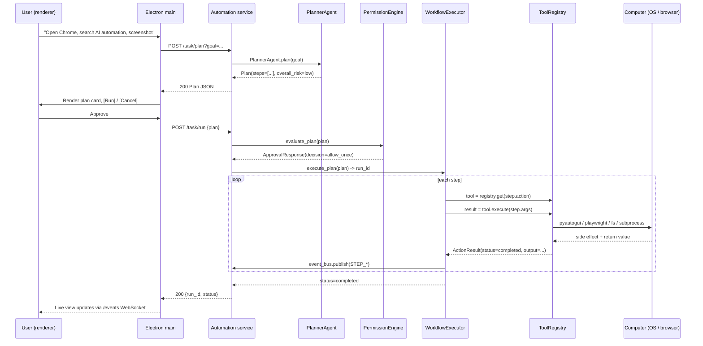
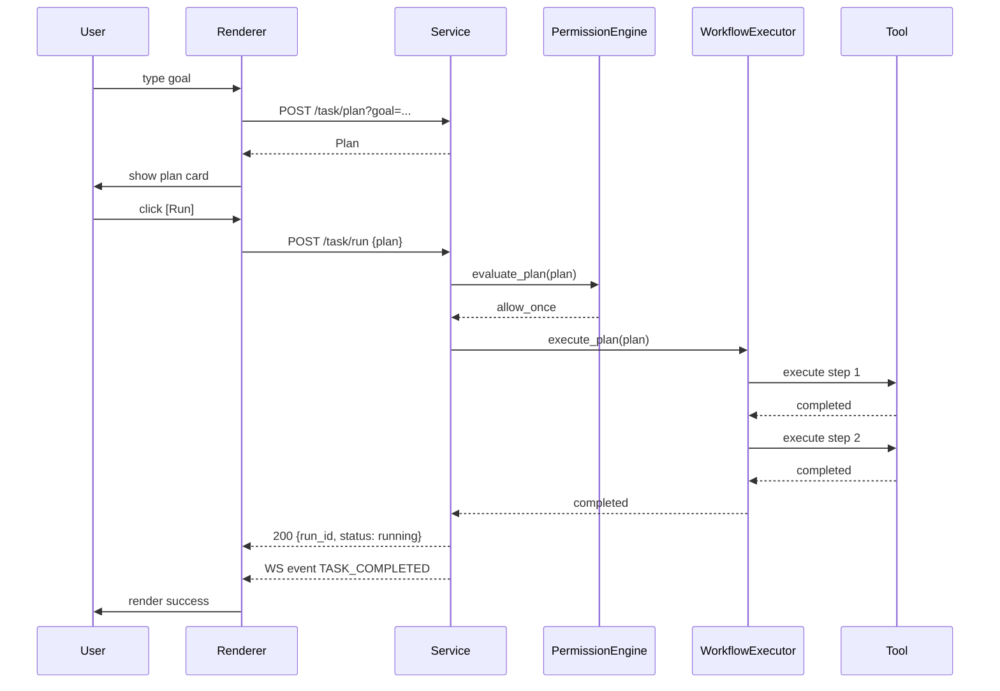
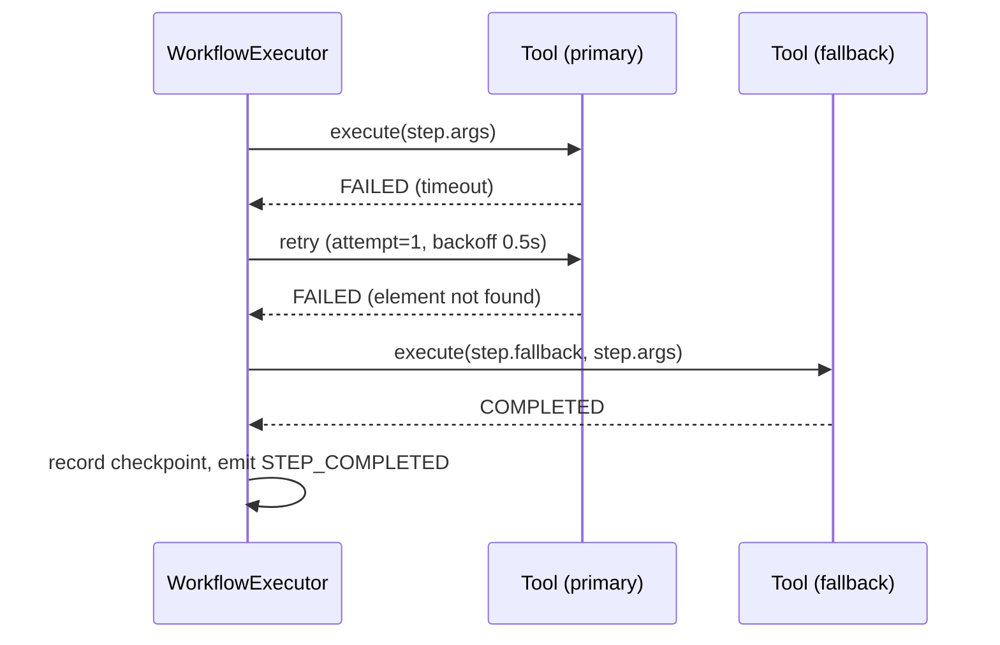
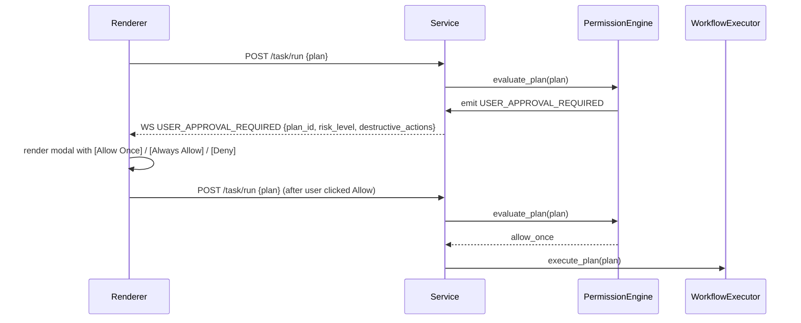

# Architecture

> High-level system architecture for the AI PC/Laptop Automation Agent.
> This document describes what is **actually implemented today** (Phase 1
> MVP) and clearly marks features that belong to later phases with
> `**Phase N — Coming Soon**` per master prompt §99.

## 1. Overview

The agent is a two-process desktop application:

1. **Electron desktop shell** (UI host) — renders a React + Vite + Tailwind
   UI, owns the window, system tray, and global hotkeys.
2. **Python automation service** (FastAPI) — owns all side-effecting
   operations: mouse, keyboard, browser, files, processes, scheduler,
   AI calls, and the database.

The two processes communicate over a **localhost-only HTTP + WebSocket
channel**. There is no remote surface; the Python service binds to
`127.0.0.1` exclusively (master prompt §5).

The core design principle (master prompt §2) is enforced everywhere:

```
User → AI Planner → Task Graph → Permission Engine →
  Automation Engine → Computer → Observation → Verification → Result
```

In words:

- The **AI** decides **WHAT** should happen.
- The **automation engine** decides **HOW** it can safely happen.
- The **security layer** decides **WHETHER** it is allowed to happen.

The AI model is **never** permitted to execute arbitrary operating-system
commands directly. It can only produce structured `Plan` objects that are
validated by Pydantic and gated by the `PermissionEngine` before any tool
is invoked.

## 2. Repository layout (as implemented)

```
/home/z/my-project/
├── apps/
│   └── automation-service/
│       └── automation_service/
│           ├── __init__.py
│           ├── main.py               # FastAPI app + WebSocket endpoint
│           ├── config.py             # ServiceSettings (Pydantic) + ensure_runtime_dirs()
│           ├── models.py             # Pydantic domain models + enums
│           ├── agents/
│           │   └── planner.py       # PlannerAgent (master prompt §7, §66)
│           ├── ai_providers/
│           │   └── base.py           # OpenAI/Anthropic/Gemini/Ollama/Custom
│           ├── engine/
│           │   ├── tool_registry.py  # Tool ABC + @register_tool + discovery
│           │   ├── workflow_executor.py
│           │   └── event_bus.py      # in-process pub/sub (master prompt §76)
│           ├── tools/
│           │   ├── mouse.py          # mouse.click / mouse.move / mouse.scroll
│           │   ├── keyboard.py       # keyboard.type / keyboard.hotkey
│           │   ├── screen.py        # screen.capture / screen.ocr
│           │   ├── files.py         # file.read / file.write / file.move / file.rename / file.list
│           │   ├── apps.py           # app.launch / window.list / process.list
│           │   └── browser.py        # browser.open / navigate / click / type / extract
│           └── security/
│               ├── permission_engine.py
│               └── kill_switch.py
├── database/
│   ├── base.py                      # SQLAlchemy 2.x Base + SessionLocal + get_db()
│   └── models/
│       ├── __init__.py
│       └── schema.py                # 22 ORM models (master prompt §27, §95)
├── docs/                             # this directory
├── workflows/                        # persisted Workflow JSON files
├── templates/                        # workflow templates (Phase 2)
├── tests/                             # **Phase 1 — Coming Soon** scaffold only
├── db/custom.db                      # SQLite database file
└── upload/                           # master prompt + scratch inputs
```

> **Note on the Electron app**: at the time of writing, the Python
> automation service is fully scaffolded and runnable. The Electron /
> React / Vite shell is **Phase 1 — Coming Soon**; the IPC contract
> described in section 4 below is what the FastAPI app already exposes,
> so when the renderer ships it can talk to a stable, documented
> surface instead of re-implementing the protocol.

## 3. Component breakdown

### 3.1 Python automation service

Source: `apps/automation-service/automation_service/main.py`

The service is a FastAPI application created with `FastAPI(lifespan=...)`.
On startup it:

1. Calls `ensure_runtime_dirs()` to create `workflows/`, `templates/`,
   `screenshots/`, `logs/`, and `db/`.
2. Calls `tool_registry.discover()` which walks every submodule of
   `automation_service.tools` and triggers each module's
   `@register_tool` decorators.
3. Publishes a `SERVICE_STARTED` event on the in-process event bus.

On shutdown it publishes `SERVICE_STOPPED` and lets pending events flush
for 100 ms before the process exits.

CORS is locked to `http://localhost:5173` (Vite dev server) and
`app://.` (Electron production renderer). No other origin is accepted.

### 3.2 Settings

Source: `apps/automation-service/automation_service/config.py`

A Pydantic `ServiceSettings` model is loaded once at import time via
`ServiceSettings.from_env()`. Key fields:

| Field | Default | Purpose |
|---|---|---|
| `host` | `127.0.0.1` | Bind address — never `0.0.0.0` |
| `port` | `8765` | IPC port |
| `mock_mode` | `True` | §64 — safe simulation mode |
| `emergency_stop_shortcut` | `ctrl+shift+esc` | §11 — global kill switch |
| `max_actions_per_minute` | `120` | §88 — rate limit |
| `max_ai_calls_per_task` | `25` | §58 — AI cost control |
| `max_task_duration_seconds` | `1800` | §88 — hard timeout |
| `max_loops` | `1000` | §43 — runaway-loop guard |
| `max_file_operations` | `500` | §88 — fs ops cap |
| `max_browser_tabs` | `8` | §88 — browser cap |
| `default_ai_provider` | `openai` | §6 — provider abstraction |
| `default_ai_model` | `gpt-4o-mini` | §6 — provider abstraction |
| `use_local_model_first` | `False` | §45 / §58 — local-first |
| `use_vision_only_when_required` | `True` | §58 / §86 |
| `min_vision_confidence` | `0.85` | §86 — don't guess |
| `ipc_token` | `None` | optional bearer token for all IPC calls |

### 3.3 Tool registry

Source: `apps/automation-service/automation_service/engine/tool_registry.py`

The registry is a small singleton (`tool_registry`) that holds a
`dict[str, Tool]` keyed by dotted tool name (e.g. `mouse.click`).
Discovery is automatic: `pkgutil.iter_modules` walks every module in
`automation_service/tools/`, imports it, and the `@register_tool`
class decorator instantiates and registers each `Tool` subclass.

The `Tool` abstract base class enforces the master prompt §8 contract:

```python
class Tool(abc.ABC):
    name: str
    description: str
    permission_level: str
    risk_level: str
    timeout_ms: int
    rollback_strategy: Optional[str]
    verification_strategy: Optional[str]
    input_schema: dict[str, Any]

    @abc.abstractmethod
    async def execute(self, args: dict[str, Any]) -> ActionResult: ...
```

`Tool.spec()` materialises a `ToolSpec` Pydantic model that the API
serialises for the renderer so the workflow builder can render a
typed input form per tool.

### 3.4 Permission engine

Source: `apps/automation-service/automation_service/security/permission_engine.py`

The `PermissionEngine` is the gate between "AI wants to do X" and "tool
actually runs". It exposes:

- `evaluate_action(action, spec) -> ApprovalResponse` — per-step gate.
- `evaluate_plan(plan) -> ApprovalResponse` — per-plan gate.
- `grant(tool_name, risk, decision)` / `revoke(...)` — remembered grants.
- `list_grants()` — UI introspection.

Decision matrix (master prompt §9 / §10):

| Risk | Default decision |
|---|---|
| LOW | auto-allow (still logged) |
| MEDIUM | auto-allow if a matching grant exists, else ask |
| HIGH | require explicit user approval |
| CRITICAL | require explicit user approval, even in autonomous mode |

Every evaluation publishes a `USER_APPROVAL_REQUIRED` event on the bus
when the decision cannot be auto-resolved.

> The current MVP implementation returns `ALLOW_ONCE` for HIGH/MEDIUM so
> the pipeline does not deadlock while the renderer is being built.
> The event payload is emitted regardless, so a UI can subscribe and
> intercept before production rollout.

### 3.5 Kill switch

Source: `apps/automation-service/automation_service/security/kill_switch.py`

A global `KillSwitch` singleton. When engaged:

1. Sets an `asyncio.Event` that every running workflow observes.
2. Publishes `EMERGENCY_STOP` on the event bus.
3. Records timestamp and reason.

Engagement routes:

- HTTP: `POST /emergency-stop`
- Hotkey: **Phase 1 — Coming Soon** (Electron globalShortcut)
- Tray button: **Phase 1 — Coming Soon**

Any tool execution or workflow step checks `kill_switch.engaged` before
and during execution. On engage, in-flight steps complete (they cannot
be interrupted mid-syscall) but no new step starts.

### 3.6 Workflow executor

Source: `apps/automation-service/automation_service/engine/workflow_executor.py`

The `WorkflowExecutor` walks a `Plan` step by step. For each step it:

1. Checks the kill switch and per-run cancel token.
2. Looks up the tool by name in `tool_registry`.
3. Runs the tool under `asyncio.wait_for(timeout=step.timeout_ms / 1000)`.
4. Retries up to `step.retry_count` with `0.5 * attempt` backoff.
5. If the tool still fails and `step.fallback` is set, runs the fallback
   tool with the same args (self-healing hook).
6. Emits `STEP_STARTED`, `STEP_COMPLETED`, `STEP_FAILED`, `TASK_*`
   events throughout.
7. Maintains a `checkpoints` list on the run record (master prompt §61).

> Full checkpoint persistence to SQLite and crash recovery UI are
> **Phase 1 — Coming Soon**. The in-memory `self._runs[run_id]`
> already captures the data structure needed; persistence is the
> remaining work.

### 3.7 Event bus

Source: `apps/automation-service/automation_service/engine/event_bus.py`

An in-process pub/sub with three subscriber kinds:

1. **Async queues** — `subscribe()` returns an `asyncio.Queue` that
   receives every event. The FastAPI `/events` WebSocket endpoint
   uses this to stream events to the renderer.
2. **Sync handlers** — `on(event_type, fn)` for synchronous subscribers.
3. **Async handlers** — `on_async(event_type, fn)` for coroutines
   scheduled with `asyncio.create_task`.

The canonical event names (master prompt §76) are defined in
`EVENT_TYPES` so typos are caught at import time.

### 3.8 AI providers

Source: `apps/automation-service/automation_service/ai_providers/base.py`

An `AIProvider` ABC with five concrete implementations:

```
AIProvider
 ├── OpenAIProvider      (openai package)
 ├── AnthropicProvider   (anthropic package)
 ├── GeminiProvider      (google-generativeai)
 ├── OllamaProvider      (aiohttp, local)
 └── CustomProvider      (OpenAI-compatible: LM Studio, vLLM, etc.)
```

A factory `get_provider(name, config)` resolves the class by string
name. Provider modules are imported lazily so a missing optional
dependency raises a clear `RuntimeError("openai package not installed")`
at call time rather than at startup.

`AIProvider._risk_from_text(text)` is a deterministic risk classifier
used as a backstop — if the AI fails to assign a risk level, this
keyword sweep decides LOW/MEDIUM/HIGH/CRITICAL based on verbs like
`delete`, `install`, `send`, etc.

### 3.9 Planner agent

Source: `apps/automation-service/automation_service/agents/planner.py`

The `PlannerAgent` converts a natural-language goal into a structured
`Plan`. It:

1. Loads the system prompt (a JSON schema + tool list + rules).
2. Calls the configured provider with `temperature=0.1, max_tokens=1500`.
3. Extracts the JSON object from the response with a tolerant regex.
4. Parses it into a `Plan` Pydantic model.
5. Falls back to a deterministic safe plan (single `screen.capture`
   step) when no provider is configured or the AI call fails — this
   is the local-first policy (§45 / §58).

The fallback path is important: the planner **never** silently fails. If
the AI is unavailable, the user still gets a runnable plan that
side-effects nothing destructive.

### 3.10 Database

Source: `database/base.py` and `database/models/schema.py`

SQLAlchemy 2.x declarative ORM. `database/base.py` exposes `engine`,
`SessionLocal`, `get_db()`, and `init_db()`. The schema defines 22
tables (see `docs/database.md`). All UUIDs are stored as `String(36)` —
SQLite has no native UUID type — and timestamps are UTC.

### 3.11 Electron desktop shell — **Phase 1 — Coming Soon**

When implemented, the Electron app will provide:

- A React 18 + Vite renderer with Tailwind CSS, Zustand stores,
  React Query for server state, and React Flow for the workflow
  builder canvas.
- A TypeScript main process with `contextIsolation: true`,
  `nodeIntegration: false`, `sandbox: true`, a strict CSP, and a
  `preload.js` that exposes a minimal `window.api` via
  `contextBridge.exposeInMainWorld`.
- IPC payloads validated by Zod schemas mirrored from the Python
  Pydantic models.
- A global hotkey listener that calls `POST /emergency-stop` on the
  service.
- A WebSocket client subscribed to `/events` for live UI updates.

## 4. Electron ↔ Python IPC contract

All endpoints are described from the renderer's perspective: the
renderer is the client, the automation service is the server.

### 4.1 HTTP endpoints (already implemented)

```
GET    /health                     # status, version, mock_mode, kill_switch state
GET    /tools                      # list registered ToolSpec objects
POST   /task/plan?goal=...         # PlannerAgent.plan(goal) -> Plan
POST   /task/run?mode=guided       # execute a Plan -> {run_id, plan_id, status}
POST   /task/cancel/{run_id}       # cancel an in-flight run

POST   /workflow                   # persist a Workflow JSON to workflows/{id}.json
GET    /workflow                   # list all saved workflows (id, name, version, enabled)

POST   /automation/click?x=&y=&button=
POST   /automation/type?text=
POST   /automation/screenshot

POST   /emergency-stop             # engage kill switch
POST   /emergency-reset            # disengage kill switch
```

Every endpoint (except `/health`) takes an optional
`Authorization: Bearer <token>` header. If `settings.ipc_token` is set,
the header is required and must match; otherwise the request is
rejected with `401 Unauthorized`.

### 4.2 WebSocket endpoint

```
WS  /events
```

Server pushes `{"type": "<EVENT_TYPE>", "payload": {...}}` JSON frames.
The frame types are the strings in `EVENT_TYPES` (see `event_bus.py`).
The connection is unidirectional server→client; client→server messages
are not used — the renderer issues commands via the HTTP endpoints
above and listens to `/events` for state changes.

A simple `ConnectionManager` broadcasts every event to every connected
client. Dead sockets are detected on send failure and pruned.

### 4.3 Typed contract — **Phase 1 — Coming Soon**

Both processes will share a `packages/shared-types/` TypeScript package
generated from the Python Pydantic models via `pydantic2ts` (or
hand-maintained mirrors). The renderer imports types like
`Plan`, `PlanStep`, `ActionResult`, `Workflow`, `WorkflowNode`, and
`ToolSpec` directly from that package so a schema drift between
the two processes is caught at compile time.

### 4.4 Security of the IPC channel

- The service binds to `127.0.0.1` only — no remote client can reach
  it. (Forced by `settings.host` default; documented in §5 of the
  master prompt.)
- CORS is locked to `http://localhost:5173` and `app://.`.
- An optional bearer token (`AUTOMATION_IPC_TOKEN` env var) can be
  required on every request.
- All request payloads are validated by Pydantic models; unknown
  fields are rejected (not silently dropped).
- Unhandled exceptions return `500` with `{"error", "type"}` and
  also publish an `UNHANDLED_ERROR` event.

## 5. End-to-end request flow

The master prompt §2 sequence in concrete terms. The numbers below
map directly to the diagram in §2.



### 5.1 User request

A user types a goal in the AI Agent screen or invokes a saved
workflow. The renderer validates the goal is non-empty and within
the maximum goal length (1000 chars), then calls `POST /task/plan`.

### 5.2 Plan generation

`POST /task/plan` instantiates a `PlannerAgent`, calls `plan(goal)`,
and returns the resulting `Plan`. The planner publishes a
`TASK_CREATED` event with `{plan_id, goal}`. If no AI provider is
configured, the deterministic fallback plan is returned instead
(see §3.9).

### 5.3 Approval

The renderer renders the plan as a card listing every step with its
risk level, confidence, and verification strategy. The user can
inspect, edit, or approve. On approval the renderer calls
`POST /task/run` with the (possibly edited) `Plan`.

The service re-evaluates the plan through the permission engine
before invoking the executor. HIGH/CRITICAL plans publish
`USER_APPROVAL_REQUIRED` again so the renderer can show the
approval dialog inline.

### 5.4 Execution

`WorkflowExecutor.execute_plan(plan)` allocates a `run_id`,
subscribes a cancel token from the kill switch, and walks the
steps. Each step is executed under `asyncio.wait_for(timeout=...)`
with a configurable retry/backoff.

Every state transition publishes an event:

```
TASK_STARTED
STEP_STARTED {run_id, step_id, tool}
STEP_COMPLETED {run_id, step_id, duration_ms}   | STEP_FAILED {run_id, step_id, error}
TASK_COMPLETED                                  | TASK_FAILED {run_id, error}
```

### 5.5 Observation & verification

After each step the executor consults `step.verification` — a string
identifier like `file_exists`, `dom_text_present`, or `screenshot_diff`.
Verification implementations live in
`apps/automation-service/automation_service/engine/verification.py`
(**Phase 1 — Coming Soon**). Until they ship, every step that returns
`COMPLETED` is treated as verified.

### 5.6 Logging

Two parallel logs are produced:

1. **Structured task logs** — written to the `task_logs` table via
   SQLAlchemy. Each row carries `task_id`, `timestamp`, `level`,
   `tool`, `target`, `status`, `duration_ms`, and a JSON `payload`.
2. **Audit logs** — written to `audit_logs` for every permission
   decision. Each row carries `user_id`, `task_id`, `tool`, `action`,
   `decision`, `risk_level`, `request_json`, `response_json`.

The renderer's History and Logs views are populated by querying these
tables (endpoints **Phase 1 — Coming Soon**; the schema is already
in place — see `docs/database.md`).

## 6. Data flow diagrams

### 6.1 User request → plan

```
[ renderer ]  --POST /task/plan?goal=...-->
              [ service/main.py ]
              --PlannerAgent.plan(goal)--> [ agents/planner.py ]
                                              |
                                              v
                                         [ AIProvider ]
                                              |
                                              v
                                         Plan (Pydantic)
                                              |
                                              v
              <--200 Plan JSON--           [ service/main.py ]
[ renderer ]  <--render plan card--
```

### 6.2 Approval → execution

```
[ renderer ]  --POST /task/run {plan}-->     [ service/main.py ]
                                              |
                                              v
                                       [ permission_engine.evaluate_plan(plan) ]
                                              |
                                              v
                                       [ workflow_executor.execute_plan(plan) ]
                                              |
                                              v
                                       for step in plan.steps:
                                          tool = registry.get(step.action)
                                          result = await tool.execute(step.args)
                                          event_bus.publish(STEP_*)
                                              |
                                              v
                                       [ event_bus ] --WS /events--> [ renderer ]
                                              |
                                              v
                                       [ task_logs / audit_logs ]  <-- SQLAlchemy
```

### 6.3 Emergency stop

```
[ tray button / hotkey / POST /emergency-stop ]
                       |
                       v
              [ kill_switch.engage() ]
                       |
                       v
       [ event_bus.publish(EMERGENCY_STOP) ] --WS /events--> [ renderer ]
                       |
                       v
       [ cancel_event.set() ]
                       |
                       v
   WorkflowExecutor next iteration sees cancel_token.is_set()
   and stops the run.
```

## 7. Sequence diagrams

### 7.1 Plan-and-run (happy path)



### 7.2 Step failure with fallback



### 7.3 Approval required



## 8. Threading model

The Python service runs under `uvicorn` with a single asyncio event
loop. All tool executions are coroutines. Blocking calls (e.g.
`pyautogui.click`) are wrapped so they release the loop where
practical; otherwise they run inline and the loop blocks briefly —
acceptable for sub-100 ms operations, unacceptable for OCR / large
file copies, which are dispatched to a thread pool via
`asyncio.to_thread()` (planned).

The renderer is a separate process; it never blocks the service and
vice versa. WebSocket frames are pushed from the same event loop,
which guarantees event ordering — a `STEP_STARTED` for step N is
always sent before `STEP_COMPLETED` for step N.

## 9. Process lifecycle

```
[ Electron main ]
   |
   +-- spawn child_process: uvicorn automation_service.main:app
   |       --host 127.0.0.1 --port 8765
   |
   +-- wait for GET /health to return 200
   |
   +-- load renderer (app://./index.html)
   |
   +-- renderer opens WS /events
   |
   +-- on quit: SIGTERM child, wait 5s, SIGKILL if needed
```

A health-check poller in the Electron main process ensures the service
is alive before the renderer attempts any IPC. If the service crashes,
the renderer shows a "Service unavailable — restarting..." banner and
the main process attempts a supervised restart up to 3 times before
giving up and showing an error report.

## 10. Failure modes and recovery

| Failure | Detection | Recovery |
|---|---|---|
| Service crash | Electron health poller misses 3 heartbeats | Restart service; renderer shows banner |
| Tool timeout | `asyncio.wait_for` raises `TimeoutError` | Retry up to `step.retry_count`, then fallback |
| Tool exception | `try/except` in `_execute_step` | Same as timeout path |
| AI provider unreachable | `PlannerAgent` catches exception | Use `_fallback_plan(goal)` |
| Kill switch engaged | Checked before every step and via cancel token | Run cancelled, `TASK_PAUSED` event emitted |
| DB locked | SQLAlchemy raises `OperationalError` | Retry with backoff; if persistent, log and continue (logs are best-effort) |
| WebSocket disconnect | `WebSocketDisconnect` raised in pusher | `manager.disconnect(ws)` and prune |

## 11. Phase map

| Phase | Status |
|---|---|
| Phase 1 MVP — Python automation service, tool registry, permission engine, FastAPI, DB schema, planner | **Implemented** (this document) |
| Phase 1 MVP — Electron + React renderer | **Phase 1 — Coming Soon** |
| Phase 2 — OCR, visual targeting, recorder, scheduler, variables, conditions, loops, notifications, voice, system tray, offline AI | **Phase 2 — Coming Soon** |
| Phase 3 — Vision model, self-healing workflows, AI recovery, intelligent target detection, task memory | **Phase 3 — Coming Soon** |
| Phase 4 — Multi-user, teams, RBAC, marketplace, plugins, integrations | **Phase 4 — Coming Soon** |
| Phase 5 — Advanced AI OS assistant (calendar-aware, meeting prep, etc.) | **Phase 5 — Coming Soon** |

Per master prompt §99, every "Coming Soon" item above is intentionally
not exposed in the UI. No fake buttons, no stub routes.

## 12. Cross-references

- Security: `docs/security.md`
- Database schema: `docs/database.md`
- Automation engine: `docs/automation-engine.md`
- AI agent: `docs/ai-agent.md`
- Workflows: `docs/workflows.md`
- Testing: `docs/testing.md`
