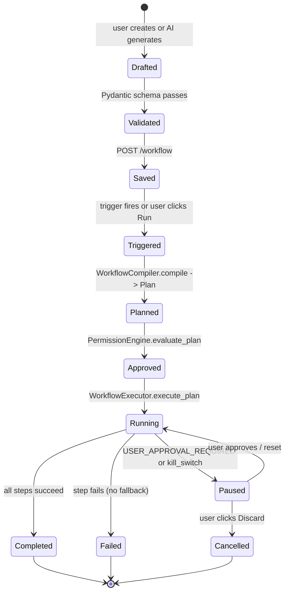

# Workflows

> Workflow data format, builder UI, executor internals, versioning,
> import/export, and the future template marketplace.
> Source-of-truth:
> `apps/automation-service/automation_service/models.py` (Pydantic
> schema), `apps/automation-service/automation_service/engine/workflow_executor.py`
> (executor), and the persisted `workflows/*.json` files.

## 1. Overview

A **workflow** is a parameterised, versioned, persisted description
of an automation. It can be:

- Triggered manually (the user clicks Run)
- Triggered automatically (schedule, file, hotkey, webhook, ...)
- Generated from a natural-language goal via the AI planner
- Recorded by the task recorder (Phase 2)
- Imported from another user (Phase 2)

Every workflow is a JSON document matching the schema in §3. The
file format is canonical (indent=2, sort_keys=False) so diffs are
meaningful and conflicts are resolvable.

## 2. Workflow JSON schema (§21)

Source: `apps/automation-service/automation_service/models.py`

```python
class WorkflowTrigger(BaseModel):
    """Master prompt §21, §24, §25."""
    type: TriggerType
    cron: Optional[str] = None          # for SCHEDULE
    file_pattern: Optional[str] = None  # for FILE
    hotkey: Optional[str] = None        # for HOTKEY
    webhook_url: Optional[str] = None   # for WEBHOOK
    timezone: str = "UTC"


class WorkflowNode(BaseModel):
    """Master prompt §20."""
    id: str
    type: str                            # e.g. 'browser.open', 'app.launch', 'if', 'for_each'
    args: dict[str, Any] = Field(default_factory=dict)
    next: Optional[str] = None           # next node id (linear by default)
    on_error: Optional[str] = None        # node id to jump to on error
    timeout_ms: int = 30_000
    retry_count: int = 0
    retry_delay_ms: int = 1000


class Workflow(BaseModel):
    """Master prompt §21 — workflow JSON format."""
    id: str
    name: str
    version: int = 1
    description: Optional[str] = None
    trigger: WorkflowTrigger = Field(default_factory=lambda: WorkflowTrigger(type=TriggerType.MANUAL))
    nodes: list[WorkflowNode]
    variables: dict[str, str] = Field(default_factory=dict)
    enabled: bool = True
    created_at: datetime = Field(default_factory=lambda: datetime.now(timezone.utc))
    updated_at: datetime = Field(default_factory=lambda: datetime.now(timezone.utc))
```

### 2.1 Example workflow

A daily 9 AM Downloads organiser (from master prompt §23):

```json
{
  "id": "wf_organise_downloads",
  "name": "Organise Downloads Daily",
  "version": 3,
  "description": "Scan Downloads, categorise, move files to typed subfolders, log summary.",
  "trigger": {
    "type": "schedule",
    "cron": "0 9 * * 1-5",
    "timezone": "Asia/Karachi"
  },
  "nodes": [
    {"id": "scan",    "type": "file.list",      "args": {"path": "{{downloads_folder}}"}, "next": "summarise"},
    {"id": "summarise","type": "file.write",    "args": {"path": "{{documents_folder}}/Organiser/log_{{today}}.txt", "content": "Scanned {{scan.count}} files"}, "next": null}
  ],
  "variables": {
    "reports_folder": "{{documents_folder}}/Reports"
  },
  "enabled": true,
  "created_at": "2026-01-15T08:00:00Z",
  "updated_at": "2026-02-20T11:30:00Z"
}
```

### 2.2 The `trigger` field

A workflow has exactly one trigger. Multi-trigger support (e.g.
"runs at 9 AM OR when a USB drive is plugged in") is achieved by
creating multiple `Trigger` rows that all point to the same
`workflow_id` (see `docs/database.md` §5.19).

### 2.3 The `nodes` field

A flat list of `WorkflowNode` objects. The default control flow is
linear (each node's `next` points at the next node in the list).
Branching (`if`, `for_each`, `parallel`) is expressed by overriding
`next` and `on_error` to point at non-adjacent nodes.

A node graph:

```
[scan] --next--> [categorise] --next--> [move_pdfs] --next--> [move_images] --next--> [summarise]
                       |
                       +--on_error--> [alert_user]
```

Serialises as:

```json
"nodes": [
  {"id": "scan", "type": "file.list", "args": {...}, "next": "categorise"},
  {"id": "categorise", "type": "file.list", "args": {...}, "next": "move_pdfs", "on_error": "alert_user"},
  {"id": "move_pdfs", "type": "file.move", "args": {...}, "next": "move_images"},
  {"id": "move_images", "type": "file.move", "args": {...}, "next": "summarise"},
  {"id": "summarise", "type": "file.write", "args": {...}, "next": null},
  {"id": "alert_user", "type": "system.notify", "args": {"title": "Categorise failed", "body": "..."}, "next": null}
]
```

### 2.4 The `variables` field

A string→string map of variables defined for this workflow. Values
may reference built-in variables (`{{today}}`,
`{{downloads_folder}}`, etc.) — substitution is recursive with a
depth cap of 5 (see `docs/automation-engine.md` §8).

## 3. Trigger types (§25)

Source: `apps/automation-service/automation_service/models.py:TriggerType`

```python
class TriggerType(str, Enum):
    SCHEDULE = "schedule"
    FILE = "file"
    APPLICATION = "application"
    BROWSER = "browser"
    HOTKEY = "hotkey"
    WEBHOOK = "webhook"
    SYSTEM = "system"
    MANUAL = "manual"
```

| Type | Fires when | Configuration |
|---|---|---|
| `schedule` | A cron expression matches | `cron`, `timezone` |
| `file` | A file matching `file_pattern` appears in a watched directory | `file_pattern` |
| `application` | A specific app launches or closes | stored in `config_json` |
| `browser` | A browser navigation matches a URL pattern | stored in `config_json` |
| `hotkey` | The user presses a global hotkey | `hotkey` (e.g. `ctrl+shift+o`) |
| `webhook` | An HTTP POST hits `/webhook/{token}` | `webhook_url` |
| `system` | System event (startup, login, idle, network available) | stored in `config_json` |
| `manual` | The user clicks Run | (none) |

### 3.1 Schedule trigger

Cron expressions use the standard 5-field format
(`minute hour day-of-month month day-of-week`). The `timezone`
field is honoured by the scheduler (Phase 2) — without it, cron
runs in the server's local time which is wrong for users in other
zones.

### 3.2 File trigger

Watches a directory (one of `ALLOWED_ROOTS`) for new files matching
a glob pattern. Implementation uses the `watchdog` package
(Phase 2). The watcher:

1. Resolves the watched directory through `_validate_path`.
2. Debounces creation events for 500 ms (some apps write a file in
   multiple chunks).
3. Emits a `FILE_CREATED` event on the bus.
4. The scheduler picks up the event and starts the workflow,
   passing `{{selected_file}}` as the new file's path.

### 3.3 Hotkey trigger

Global hotkeys are registered by the Electron main process via
`globalShortcut.register(hotkey, callback)` (Phase 1). When the
hotkey fires, the main process calls `POST /task/run` with the
associated workflow's id.

### 3.4 Webhook trigger

The service exposes `POST /webhook/{token}` (planned). The token is
generated when the webhook trigger is created and stored in
`triggers.config_json`. The endpoint:

1. Validates the token.
2. Validates the request body against a per-trigger schema
   (default: any JSON).
3. Starts the workflow with `{{webhook_body}}` as a variable.

Webhook triggers are localhost-only by default; remote webhooks
are rejected at the network layer (CORS + bind address).

> All non-manual triggers are **Phase 2 — Coming Soon**. The
> `TriggerType` enum and `triggers` table exist; the runtime
> that watches / polls / listens is the remaining work.

## 4. Node types (§20)

Source: master prompt §20.

```
Control
  Start, End
Apps
  Open App, Close App
Mouse / Keyboard
  Click, Double Click, Type, Hotkey, Wait
Screen
  Screenshot, OCR, Find Image, Find Text
Browser
  Open Browser, Navigate, Browser Click, Browser Type, Extract Data, Download
Files
  Read File, Write File, Move File, Rename File, Copy File
Logic
  Condition, Loop, For Each, While, Wait Until
AI
  AI Decision, Ask User, Approval
Code
  Run Command, Run Python
Notifications
  Notification, Email, Webhook
Error handling
  Retry, Error Handler
```

### 4.1 Mapping node types to tools

Most node types correspond directly to a tool in the registry:

| Node type | Tool name |
|---|---|
| Click | `mouse.click` |
| Double Click | `mouse.click` (args: `clicks: 2`) |
| Type | `keyboard.type` |
| Hotkey | `keyboard.hotkey` |
| Screenshot | `screen.capture` |
| OCR | `screen.ocr` |
| Open Browser | `browser.open` |
| Navigate | `browser.navigate` |
| Browser Click | `browser.click` |
| Browser Type | `browser.type` |
| Extract Data | `browser.extract` |
| Open App | `app.launch` |
| Read File | `file.read` |
| Write File | `file.write` |
| Move File | `file.move` |
| Rename File | `file.rename` |
| Copy File | `file.copy` (Phase 2) |
| Download | `browser.download` (Phase 2) |

### 4.2 Pure-logic node types

These do not call a tool; they control flow:

| Node type | Behaviour |
|---|---|
| Start | Entry point (one per workflow) |
| End | Marks the run completed |
| Condition (`if`) | Evaluate a predicate, branch to `next` / `on_false` |
| Loop / For Each | Iterate a body graph for each item |
| While | Iterate while a predicate holds |
| Wait Until | Block until a predicate holds (with timeout) |
| AI Decision | Ask the planner for the next step |
| Ask User | Show a prompt in the renderer; pause until answered |
| Approval | Force a permission prompt regardless of risk level |
| Retry | Wrap a sub-graph with retry semantics |
| Error Handler | Catch errors from a sub-graph |

### 4.3 Code node types

| Node type | Risk | Notes |
|---|---|---|
| Run Command | CRITICAL | Allowlisted shell only; no shell metacharacters |
| Run Python | CRITICAL | Sandboxed subprocess; no network; capped timeout |

> Code node types are **Phase 2 — Coming Soon**.

### 4.4 Notification node types

| Node type | Implementation |
|---|---|
| Notification | `system.notify` tool (planned) |
| Email | SMTP integration (Phase 4) |
| Webhook | `aiohttp` POST (Phase 2) |

## 5. Workflow builder UI (§34)

> The React + React Flow workflow builder is **Phase 1 — Coming
> Soon**. The contract it will talk to is already stable (the
> `Workflow` Pydantic schema), so the builder can be developed
> against the existing API.

The builder has three panes per master prompt §34:

```
+-------------------------------------------------------+
| Workflow Name                            Run   Save   |
+--------------+---------------------------+------------+
| Actions      | Canvas                    | Inspector  |
|              |                           |            |
| Browser      |   [Start]                 | Settings   |
| Desktop      |     |                     |            |
| Files        |   [Open Browser]          | timeout    |
| AI           |     |                     | retry      |
| Logic        |   [Navigate]              | fallback   |
|              |     |                     |            |
|              |   [Download]              |            |
|              |     |                     |            |
|              |   [End]                   |            |
+--------------+---------------------------+------------+
```

### 5.1 Actions panel

The left pane groups available node types by category (Browser,
Desktop, Files, AI, Logic, Notifications). Clicking a category
expands its node types; dragging a node type onto the canvas
inserts a new node with default args.

The list is populated from `GET /tools` (for tool-backed nodes)
plus a hardcoded list of pure-logic node types (`if`, `for_each`,
`while`, `ask_user`, etc.).

### 5.2 Canvas (React Flow)

The middle pane is a [React Flow](https://reactflow.dev/) canvas.
Each node is a card with:

- The node type icon
- The node's `id`
- A one-line summary of its `args` (e.g. `path: report.txt`)
- Status indicator (when running: pending / running / done / failed)
- Input and output handles for connecting edges

Edges are typed:

| Edge type | Meaning |
|---|---|
| `next` | Default success path (green) |
| `on_error` | Error path (red) |
| `on_true` / `on_false` | Condition branches (blue / grey) |
| `loop_body` | Body of a loop node (purple) |

React Flow's data model maps directly to the `WorkflowNode` schema
plus a positional `position: {x, y}` for rendering. Position is
stripped before persisting to keep the JSON portable across screen
sizes.

### 5.3 Inspector

The right pane renders a form for the currently selected node.
The form is generated from the node's `input_schema` (for
tool-backed nodes) or from a hand-written form schema (for
pure-logic nodes). Common fields:

- `id` — text input
- `args.*` — per-schema (string / integer / enum / object)
- `timeout_ms` — integer with slider
- `retry_count` — integer with slider (0–10)
- `retry_delay_ms` — integer
- `fallback` — dropdown of compatible tool names
- `verification` — dropdown of verification strategies
- `next` — dropdown of other node ids
- `on_error` — dropdown of other node ids

The inspector validates the form against `input_schema` on every
change and disables the Save button until the workflow is valid.

## 6. Workflow executor internals

Source: `apps/automation-service/automation_service/engine/workflow_executor.py`

The executor's full design is in `docs/automation-engine.md` §7.
The workflow-specific summary:

1. **`execute_plan(plan)`** — accepts a `Plan` (a workflow run
   is a plan run; workflows are compiled into plans at trigger
   time).
2. **Workflow → Plan compilation** (planned in `WorkflowCompiler`)
   — walks the workflow's node graph, resolves variables, expands
   loops into repeated steps, and emits a flat `Plan` the executor
   can walk linearly.
3. **Step execution** — per `docs/automation-engine.md` §7.2.
4. **Event emission** — every transition publishes on the bus.

### 6.1 Workflow → Plan compilation

> The compiler is **Phase 1 — Coming Soon**. The MVP runs `Plan`
> objects directly (produced by the AI planner or hand-written).
> The compiler that turns a node graph into a `Plan` is the
> remaining work.

Planned structure:

```python
class WorkflowCompiler:
    def compile(self, workflow: Workflow, trigger_payload: dict) -> Plan:
        steps: list[PlanStep] = []
        for node in self._topological_sort(workflow.nodes):
            step = PlanStep(
                id=node.id,
                action=self._action_for_node(node),
                args=self._resolve_variables(node.args, workflow.variables, trigger_payload),
                risk_level=self._risk_for_node(node),
                confidence=1.0,
                timeout_ms=node.timeout_ms,
                retry_count=node.retry_count,
                fallback=self._fallback_for_node(node),
                verification=self._verification_for_node(node),
            )
            steps.append(step)
        return Plan(
            goal=workflow.name,
            steps=steps,
            required_permissions=[PermissionLevel.ALLOW_ONCE],
            overall_risk=max((s.risk_level for s in steps), default=RiskLevel.LOW),
            potential_side_effects=[],
            estimated_duration_seconds=sum(s.timeout_ms for s in steps) // 1000,
            variables=workflow.variables,
        )
```

The compiler respects the `next` / `on_error` edges to decide step
ordering and the `if` / `for_each` / `while` nodes to expand into
multiple steps.

## 7. Checkpoint and resume (§61)

Long workflows checkpoint after every successful step. The
in-memory `self._runs[run_id]["checkpoints"]` list (see
`docs/automation-engine.md` §7.3) captures the data structure; the
persistence to `workflow_runs.checkpoint_json` is **Phase 1 —
Coming Soon**.

Resume flow:

```
[ renderer: POST /task/resume/{run_id} ]
                |
                v
[ WorkflowExecutor.resume(run_id) ]
                |
                v
[ Load original Plan from tasks.plan_json ]
                |
                v
[ Filter out steps whose id is in checkpoints ]
                |
                v
[ execute_plan(filtered_plan, run_id=run_id) ]
```

Three options on the crash-recovery UI:

- **Resume** — continue from the last checkpoint.
- **Restart** — start over with the original plan, fresh `run_id`.
- **Discard** — mark the run cancelled, no further action.

## 8. Crash recovery (§62)

When the service starts, it scans `workflow_runs` for rows with
`status IN ('running', 'paused')` (the service was killed mid-run).
For each, it emits a `TASK_PAUSED` event with `reason="crash_recovery"`
and exposes them via `GET /task/interrupted` (planned).

The renderer shows:

```
An automation was interrupted.

{goal}

Last completed step:
{step_id}

[Resume] [Restart] [Discard]
```

> Crash recovery UI is **Phase 1 — Coming Soon**. The schema,
> the `idx_workflow_runs_status` index, and the event payload
> already exist; the startup scan + the `/task/interrupted` route
> are the remaining work.

## 9. Workflow import / export (§51)

### 9.1 Export

`GET /workflow/{id}/export` returns the workflow JSON plus its
metadata (name, description, version, trigger, nodes, variables).
The user can download it as a `.json` file or copy it to the
clipboard.

### 9.2 Import

`POST /workflow/import` accepts a workflow JSON. It:

1. Validates the JSON against the `Workflow` Pydantic schema.
2. Scans every node's `type` and flags any that:
   - Reference unknown tools (not in the registry).
   - Are CRITICAL risk (`Run Command`, `Run Python`, `file.delete`).
3. Replaces the workflow's `id` with a fresh UUID so the import
   cannot overwrite an existing workflow.
4. Marks the imported workflow `enabled = false` — it must be
   explicitly enabled before any trigger fires.
5. Returns the imported workflow with a list of `warnings` (e.g.
   "Contains CRITICAL steps; requires explicit approval").

### 9.3 Never auto-execute imported workflows

This is a hard rule (master prompt §51). Imported workflows:

- Are saved with `enabled = false`.
- Have no triggers created.
- Cannot be run via `POST /task/run` until the user opens them in
  the builder, reviews every node, and clicks "Approve &
  Enable".

The renderer renders the workflow's permission requirements before
execution: a modal listing every tool the workflow uses with its
risk level, plus every external URL it will navigate to.

> The import/export endpoints are **Phase 2 — Coming Soon**. The
> schema validation is already done by Pydantic; the route +
> permission scan + warning list are the remaining work.

## 10. Versioning (§21)

Workflows are versioned. Every save creates a new
`WorkflowVersion` row:

```python
class WorkflowVersion(Base):
    __tablename__ = "workflow_versions"
    id            = String(36), PK
    workflow_id   = FK -> workflows.id, indexed
    version       = Integer
    trigger_json  = JSON
    nodes_json    = JSON
    variables_json = JSON
    is_active     = Boolean
    created_at    = DateTime
```

Only one version per workflow has `is_active = True` at a time.
The active version is what runs when the workflow is triggered.

### 10.1 Restoring a previous version

`POST /workflow/{id}/restore/{version}` sets `is_active = false`
on the current active version and `is_active = true` on the
specified version. The renderer's "Versions" panel shows the
history:

```
Workflow: Organise Downloads Daily

v3 (active)  - 2026-02-20 11:30  - added alert_user error handler
v2           - 2026-01-30 09:15  - split move step into PDFs / images
v1           - 2026-01-15 08:00  - initial version

[View]  [Restore]  [Diff]
```

The Diff button shows a JSON diff between two versions
(deep-diff library, planned).

> Version restore endpoint is **Phase 1 — Coming Soon**. The
> `WorkflowVersion` table and `is_active` column exist; the
> restore route is the remaining work.

## 11. Template marketplace (§52)

> The template marketplace is **Phase 4 — Coming Soon**.

The marketplace will be a curated catalogue of workflow templates
that users can browse, preview, and import. Each template:

1. Is signed by the marketplace operator (publisher key).
2. Lists its required permissions upfront.
3. Is sandboxed on import: it cannot run until the user has
   reviewed every node and clicked "Approve & Enable".
4. Is permission-scanned: a static analysis pass flags any node
   whose `type` is `Run Command`, `Run Python`, `file.delete`,
   or that references a URL outside the marketplace's domain
   allowlist.

Example categories (from master prompt §52):

- Excel automation
- PDF automation
- Email automation
- Browser automation
- File organization
- Developer workflows
- Marketing workflows
- Data-entry workflows
- Reporting workflows

The marketplace is explicitly **not** a general-purpose plugin
store. Templates are workflows only — they cannot ship arbitrary
Python code.

## 12. Persistence

Workflows are persisted in two places:

1. **SQLite** — `workflows`, `workflow_versions`, `workflow_nodes`
   (see `docs/database.md` §5.9–§5.11). This is the source of truth
   for trigger scheduling, run history, and version management.
2. **Filesystem** — `workflows/{id}.json` for each workflow. This
   is a convenience mirror so users can `git diff` their workflows,
   back them up via `git`, and share them outside the app.

The FastAPI route `POST /workflow` writes both: it inserts/updates
the SQLite rows AND writes the JSON file. The two are kept in sync
on every save; if they diverge (e.g. the JSON file was hand-edited
on disk), the SQLite row wins on the next `GET /workflow` call,
which re-reads the JSON file and updates the DB.

```python
# apps/automation-service/automation_service/main.py
@app.post("/workflow", dependencies=[Depends(verify_ipc_token)])
async def save_workflow(workflow: Workflow) -> dict:
    wf_path = settings.workflows_dir / f"{workflow.id}.json"
    wf_path.write_text(workflow.model_dump_json(indent=2), encoding="utf-8")
    return {"id": workflow.id, "saved": True}


@app.get("/workflow", dependencies=[Depends(verify_ipc_token)])
async def list_workflows() -> list[dict]:
    out = []
    for p in settings.workflows_dir.glob("*.json"):
        try:
            wf = Workflow.model_validate_json(p.read_text(encoding="utf-8"))
            out.append({"id": wf.id, "name": wf.name, "version": wf.version, "enabled": wf.enabled})
        except Exception:
            continue
    return out
```

## 13. Workflow → Plan → Run lifecycle



## 14. Validation rules

Every workflow is validated on save. The validation rules:

1. `id` is a non-empty string ≤ 64 chars.
2. `name` is a non-empty string ≤ 255 chars.
3. `version` is a positive integer.
4. `nodes` is a non-empty list with ≤ 1000 nodes.
5. Every node has a unique `id` within the workflow.
6. Every node's `type` is either:
   - A registered tool name (e.g. `mouse.click`), OR
   - A pure-logic type (`if`, `for_each`, `while`, `wait_until`,
     `ask_user`, `approval`, `retry`, `error_handler`, `start`,
     `end`).
7. Every node's `next` either points at an existing node id or is
   `null`.
8. Every node's `on_error` either points at an existing node id
   or is `null`.
9. There is exactly one `start` node.
10. Every node (except `end`) is reachable from `start`.
11. There are no cycles in the `next` graph (cycles in `for_each`
    / `while` body graphs are allowed and bounded by `max_loops`).
12. `variables` keys match `^[a-zA-Z_][a-zA-Z0-9_]*$`.
13. `trigger.type` is a valid `TriggerType` enum value.

If any rule fails, the save returns `400 Bad Request` with a list
of `{path, message}` errors.

## 15. Phase map

| Feature | Status |
|---|---|
| Workflow JSON schema (Pydantic) | Implemented |
| `POST /workflow` + `GET /workflow` routes | Implemented |
| Filesystem mirror in `workflows/*.json` | Implemented |
| `WorkflowVersion` table (schema) | Implemented |
| `WorkflowNode` table (denormalised, schema) | Implemented |
| `scheduled_jobs` table (schema) | Implemented |
| `triggers` table (schema) | Implemented |
| AI planner produces Plans (not workflows) | Implemented |
| Workflow builder UI (React Flow) | **Phase 1 — Coming Soon** |
| Workflow → Plan compiler | **Phase 1 — Coming Soon** |
| Schedule trigger runtime | **Phase 2 — Coming Soon** |
| File trigger runtime (watchdog) | **Phase 2 — Coming Soon** |
| Hotkey trigger runtime (Electron globalShortcut) | **Phase 1 — Coming Soon** |
| Webhook trigger runtime | **Phase 2 — Coming Soon** |
| Application / Browser / System triggers | **Phase 2 — Coming Soon** |
| Conditions (`if`) | **Phase 2 — Coming Soon** |
| Loops (`for_each`, `while`, `batch`) | **Phase 2 — Coming Soon** |
| Parallel execution | **Phase 2 — Coming Soon** |
| Variables substitution | **Phase 1 — Coming Soon** |
| Checkpoint persistence | **Phase 1 — Coming Soon** |
| Resume / Restart / Discard UI | **Phase 1 — Coming Soon** |
| Crash recovery scan | **Phase 1 — Coming Soon** |
| Import / export endpoints | **Phase 2 — Coming Soon** |
| Permission scan on import | **Phase 2 — Coming Soon** |
| Version restore endpoint | **Phase 1 — Coming Soon** |
| Version diff view | **Phase 2 — Coming Soon** |
| Template marketplace | **Phase 4 — Coming Soon** |
| Task recorder | **Phase 2 — Coming Soon** |
